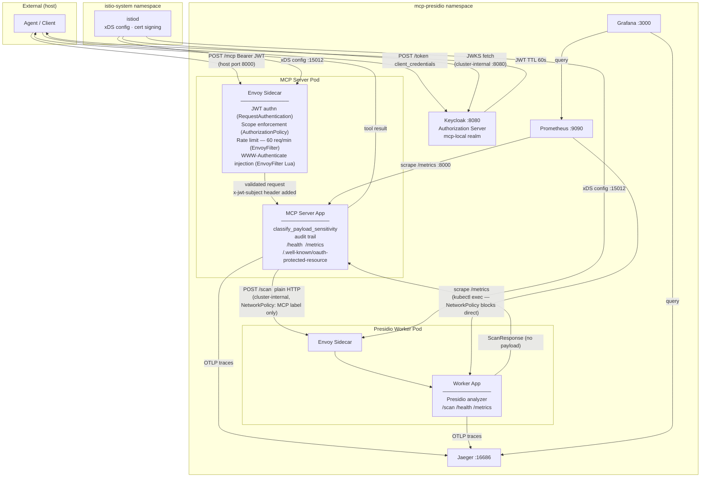

# Architecture Diagram — Phase 2 (Istio/Envoy)

Shows all components and communication paths as of Phase 2 (DEC-003).
Auth enforcement, rate limiting, and RFC 9728 WWW-Authenticate header
injection are handled by the Envoy sidecar — not application code.

## Key boundaries

| Boundary | Rule |
|---|---|
| Worker ingress | NetworkPolicy: allow from MCP server pod label only — no direct external access |
| MCP server egress | NetworkPolicy: worker + Keycloak + istiod + DNS only — no internet |
| istiod → Keycloak | Uses cluster-internal URL (`keycloak.mcp-presidio.svc.cluster.local`) not `localhost:8080` |
| Prometheus → Worker | Cannot scrape directly (NetworkPolicy); uses `kubectl exec` — Phase 3 fix needed |
| EnvoyFilter CRDs | Accepted for Phase 2 only; replace before Phase 3 (see DEC-005) |
