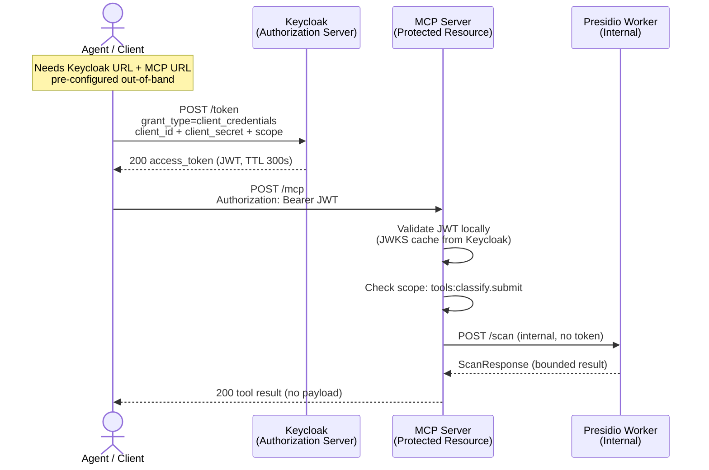
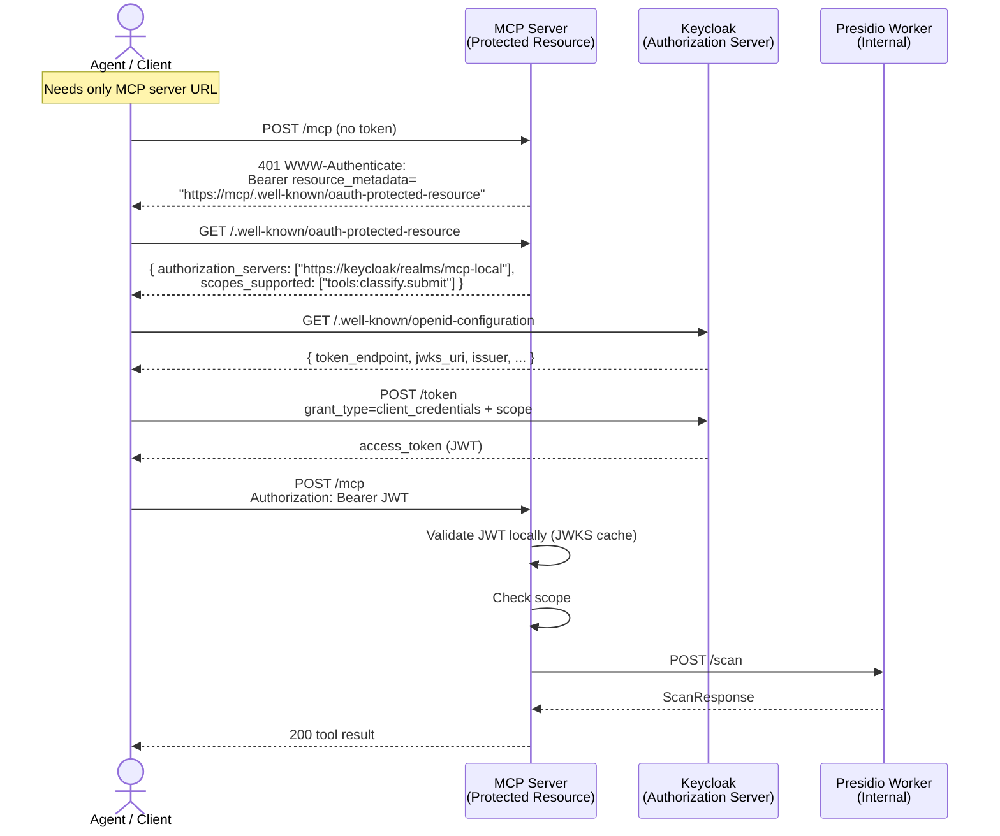
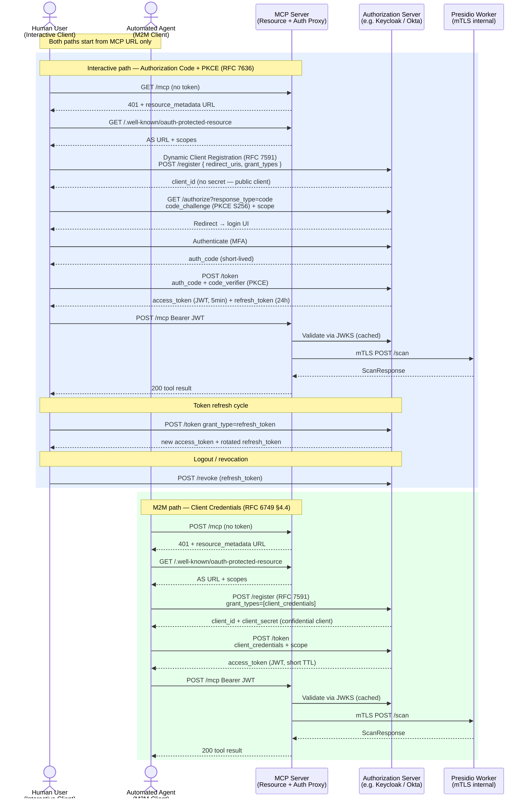

# Auth Connection Flows

Three views: what we built, what the ideal looks like, and the industry standard.

---

## Flow 1 — Current Implementation

Client needs **two URLs pre-configured**: Keycloak token endpoint + MCP server URL.
Discovery is skipped; credentials are injected out-of-band (demo script / Helm config).

---

## Flow 2 — Ideal (RFC 9728 Discovery)

Client needs **only the MCP server URL**. Everything else is discovered.
This is what our RFC 9728 fix enables — a compliant client can now do this chain.

---

## Flow 3 — Industry Standard (OAuth 2.1 + MCP Auth Spec)

Full MCP Authorization Specification (2025) + OAuth 2.1 + RFC 7591 Dynamic Client Registration.
Covers both **interactive user clients** (auth code + PKCE) and **M2M agents** (client credentials).
mTLS enforced between all services. Short-lived tokens. Refresh + revocation lifecycle.

---

## Gap Analysis — Current vs Ideal vs Standard

| Capability | Current | Ideal (Flow 2) | Industry Standard (Flow 3) |
|---|---|---|---|
| Client needs only MCP URL | No — needs Keycloak URL too | **Yes** | **Yes** |
| RFC 9728 resource_metadata in 401 | **Yes** (just fixed) | **Yes** | **Yes** |
| RFC 9728 discovery document | **Yes** | **Yes** | **Yes** |
| Dynamic Client Registration (RFC 7591) | No | No | **Yes** |
| Auth Code + PKCE for interactive users | No | No | **Yes** |
| Client Credentials for M2M | **Yes** | **Yes** | **Yes** |
| Refresh token lifecycle | No | No | **Yes** |
| Token revocation | No | No | **Yes** |
| mTLS between services | No (HTTP internal) | No | **Yes** |
| Short-lived tokens (< 5min) | No (300s) | No (300s) | **Yes** |
| MFA on interactive path | No | No | **Yes** |
