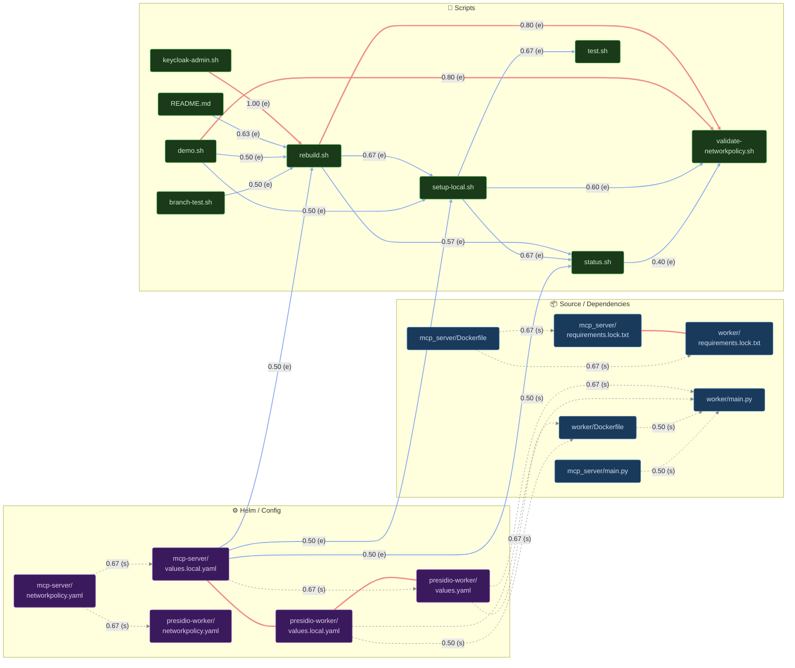

# Temporal Coupling Diagram

Generated from `planning/coupling-data.json` — 91 commits, 4 excluded (>15 files).
Strong and moderate pairs only (score ≥ 0.40). Weak pairs omitted for clarity.

Edge weight legend:
- `===` thick solid — strong (≥ 0.75), early/sparse confidence
- `-->` solid — moderate (0.40–0.74), early confidence (≥ 4 co-changes)
- `-.->` dashed — moderate (0.40–0.74), sparse confidence (2–3 co-changes)

Score shown on each edge. Confidence shown as `(e)` = early, `(s)` = sparse.

---

---

## Reading the graph

| Element | Meaning |
|---------|---------|
| Red thick edges | Strong coupling — these files have moved together in ≥75% of commits touching either |
| Blue solid edges | Moderate, early confidence — statistically building (≥4 co-changes observed) |
| Grey dashed edges | Moderate, sparse — real signal but only 2–3 observations; watch for confirmation |
| `(e)` on edge | Early confidence — enough history to be directional, not yet stable |
| `(s)` on edge | Sparse confidence — treat as a hypothesis, not a rule |

## Key observations

**`rebuild.sh` is the hub.** Highest edge degree in the scripts cluster. Touches
keycloak-admin (1.0), validate-networkpolicy (0.80), README (0.63), setup-local (0.67),
status (0.57), demo (0.50), branch-test (0.50). Any branch touching rebuild.sh should
treat all of these as review candidates.

**Both lock files are one logical unit.** 1.0 bidirectional — never touched independently.
`mcp_server/Dockerfile` is an upstream trigger (dashed edges into both lock files).

**`validate-networkpolicy.sh` is a pure sink.** High in-degree from rebuild, demo, setup,
status — nothing points away from it. Changes there don't ripple; changes everywhere else
require re-checking it.

**Worker Helm → source (sparse dashed).** `values.yaml → worker/Dockerfile` and
`values.yaml → worker/main.py` suggest env var additions propagate from Helm config
into application code simultaneously. Watch for confirmation.
