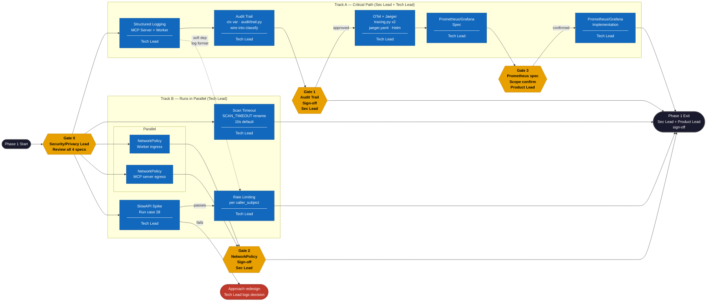

# Phase 1 Pipeline

```mermaid
flowchart LR
    START([Phase 1 Start])

    SPEC_REVIEW{{"Gate 0\nSecurity/Privacy Lead\nReview all 4 specs"}}

    subgraph TRACKA ["Track A — Critical Path  (Sec Lead + Tech Lead)"]
        direction LR
        A1["Structured Logging\nMCP Server + Worker\n─────────────────\nTech Lead"]
        A2["Audit Trail\nctx var · audit/trail.py\nwire into classify\n─────────────────\nTech Lead"]
        A3["OTel + Jaeger\ntracing.py x2\njaeger.yaml · Helm\n─────────────────\nTech Lead"]
        A4S["Prometheus/Grafana\nSpec\n─────────────────\nTech Lead"]
        A4I["Prometheus/Grafana\nImplementation\n─────────────────\nTech Lead"]
    end

    subgraph TRACKB ["Track B — Runs in Parallel  (Tech Lead)"]
        direction LR
        B1["Scan Timeout\nSCAN_TIMEOUT rename\n10s default\n─────────────────\nTech Lead"]
        subgraph BPAR ["Parallel"]
            direction TB
            B2a["NetworkPolicy\nWorker ingress"]
            B2b["NetworkPolicy\nMCP server egress"]
        end
        B3["SlowAPI Spike\nRun case 28\n─────────────────\nTech Lead"]
        B4["Rate Limiting\nper caller_subject\n─────────────────\nTech Lead"]
    end

    G_AT{{"Gate 1\nAudit Trail\nSign-off\nSec Lead"}}
    G_NP{{"Gate 2\nNetworkPolicy\nSign-off\nSec Lead"}}
    G_PG{{"Gate 3\nPrometheus spec\nScope confirm\nProduct Lead"}}

    EXIT([Phase 1 Exit\nSec Lead + Product Lead\nsign-off])
    SPIKE_FAIL(["Approach redesign\nTech Lead logs decision"])

    START --> SPEC_REVIEW

    SPEC_REVIEW --> A1
    SPEC_REVIEW --> B1
    SPEC_REVIEW --> B2a
    SPEC_REVIEW --> B2b
    SPEC_REVIEW --> B3

    A1 --> A2
    A2 --> G_AT
    G_AT -->|approved| A3
    A3 --> A4S
    A4S --> G_PG
    G_PG -->|confirmed| A4I

    A1 -.->|soft dep\nlog format| B4

    B2a --> G_NP
    B2b --> G_NP
    B3 -->|passes| B4
    B3 -->|fails| SPIKE_FAIL

    A4I --> EXIT
    G_AT --> EXIT
    G_NP --> EXIT
    B1 --> EXIT
    B4 --> EXIT

    classDef gate fill:#e8a000,stroke:#b07800,color:#000,font-weight:bold
    classDef work fill:#1168bd,stroke:#0a4d8c,color:#fff
    classDef terminal fill:#1a1a2e,stroke:#555,color:#fff
    classDef warn fill:#c0392b,stroke:#922b21,color:#fff

    class SPEC_REVIEW,G_AT,G_NP,G_PG gate
    class A1,A2,A3,A4S,A4I,B1,B2a,B2b,B3,B4 work
    class START,EXIT terminal
    class SPIKE_FAIL warn
```
