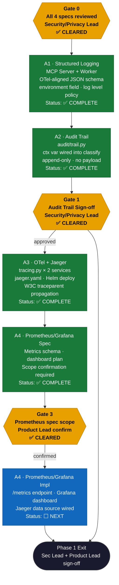
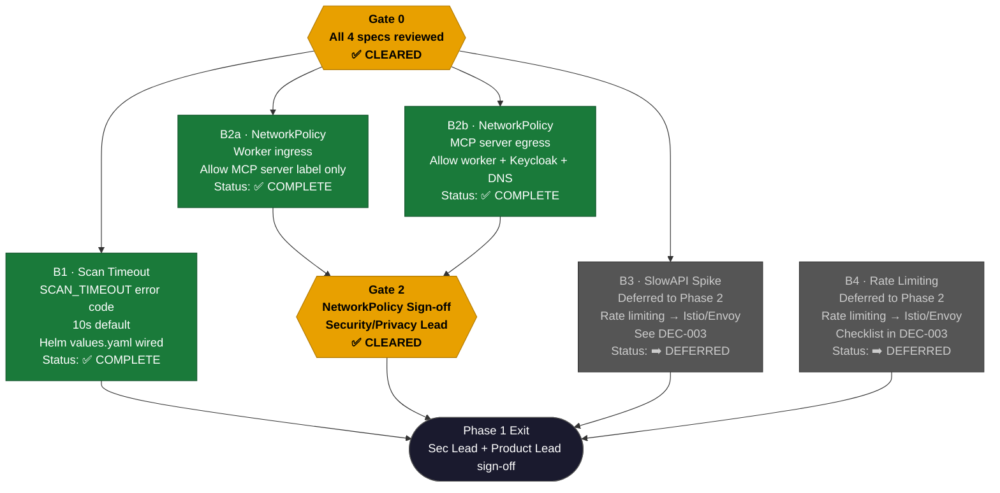

# Phase 1 Pipeline

## Track A — Critical Path

Structured logging is the foundation. Each step gates the next. Gate 1 (audit trail
sign-off) is required for Phase 1 exit regardless of Track B status.

---

## Track B — Parallel Hardening

Runs concurrently with Track A. Gate 2 (NetworkPolicy) is required for Phase 1 exit.
Rate limiting (B4) has a soft dependency on A1 log format being stable.

---

## Pre-Phase 2 Gate — k3d Migration (DEC-004)

Must complete before Phase 2 (Istio/Cilium) work begins. No Phase 1 deliverable is
blocked. See `planning/decision-log.md` DEC-004 for full rationale and work breakdown.

```mermaid
flowchart LR
    P1EXIT(["Phase 1 Exit"])

    GK{{"Pre-Phase 2 Gate\nk3d migration complete\nAll validation scripts pass\n⬜ PENDING"}}

    KA["A · Cluster + Registry\nk3d-config.yaml\nsetup-local.sh updated\nRegistry on port 5000\nStatus: ⬜"]

    KB["B · Image Workflow\nrebuild.sh: kind load → docker push\nvalues.local.yaml: pullPolicy + registry\nStatus: ⬜"]

    KC["C · Supporting Scripts\nstatus.sh · README · remove kind-config\nStatus: ⬜"]

    KD["D · Full Regression\nsetup · status · test · auth\nnetworkpolicy · demo a\nStatus: ⬜"]

    KE["E · Cilium CNI (optional)\nDisable Flannel · install Cilium\nRe-validate NetworkPolicy\nStatus: ⬜ Phase 2 only"]

    P2START(["Phase 2 Start\nIstio · Cilium · cert-manager"])

    P1EXIT --> GK
    GK --> KA
    KA --> KB
    KB --> KC
    KC --> KD
    KD --> P2START
    KD --> KE
    KE --> P2START

    classDef gate fill:#e8a000,stroke:#b07800,color:#000,font-weight:bold
    classDef work fill:#1168bd,stroke:#0a4d8c,color:#fff
    classDef optional fill:#555,stroke:#333,color:#ccc
    classDef terminal fill:#1a1a2e,stroke:#555,color:#fff

    class GK gate
    class KA,KB,KC,KD work
    class KE optional
    class P1EXIT,P2START terminal
```

