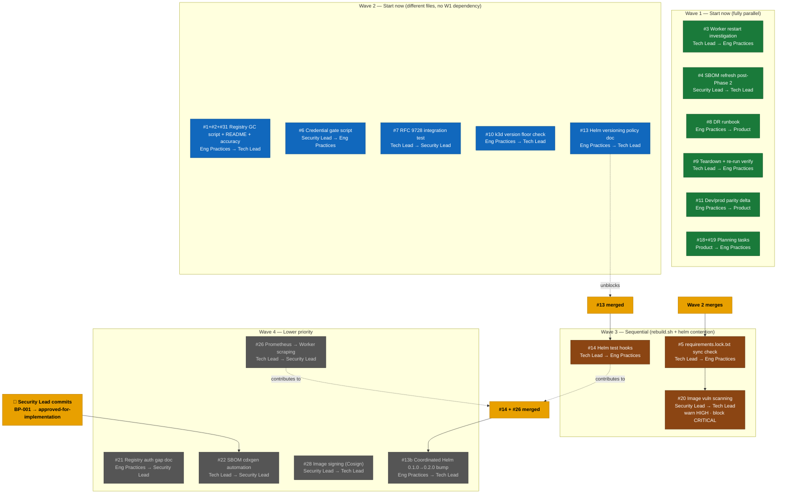

# Tech Debt Wave Plan

Waves 1 and 2 can both start immediately — different files, no contention.
Wave 3 has hard sequencing within it. Wave 4 is lower priority with two gates.

## Branch name reference

| Wave | Branch | Items |
|------|--------|-------|
| 1 | `3-worker-restart-investigation` | #3 |
| 1 | `4-sbom-refresh` | #4 |
| 1 | `8-dr-runbook` | #8 |
| 1 | `9-teardown-verification` | #9 |
| 1 | `11-parity-delta` | #11 |
| 1 | `18-19-planning` | #18, #19 |
| 2 | `1-2-31-registry-gc` | #1, #2, #31 |
| 2 | `6-credential-gate` | #6 |
| 2 | `7-rfc9728-integration-test` | #7 |
| 2 | `10-k3d-version-check` | #10 |
| 2 | `13-helm-version-policy` | #13 |
| 3 | `5-lockfile-sync-check` | #5 |
| 3 | `14-helm-test-hooks` | #14 |
| 3 | `20-image-vuln-scanning` | #20 |
| 4 | `21-registry-auth-gap` | #21 |
| 4 | `22-sbom-cdxgen` | #22 (gate: Security Lead BP-001 sign-off) |
| 4 | `26-prometheus-worker-scraping` | #26 |
| 4 | `28-image-signing` | #28 |
| 4 | `13b-helm-version-bump` | #13b (gate: #14 + #26 merged) |
